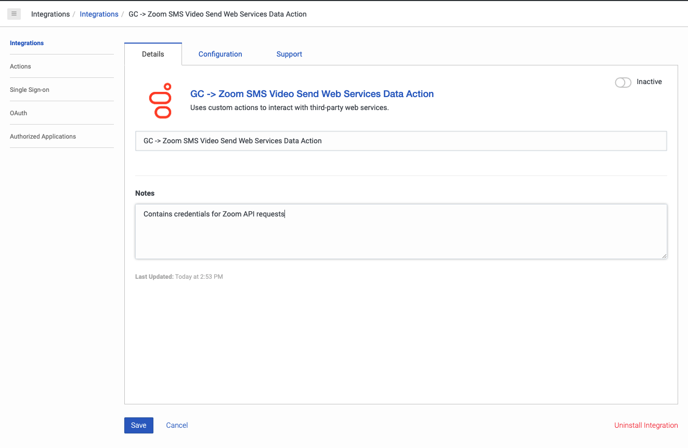
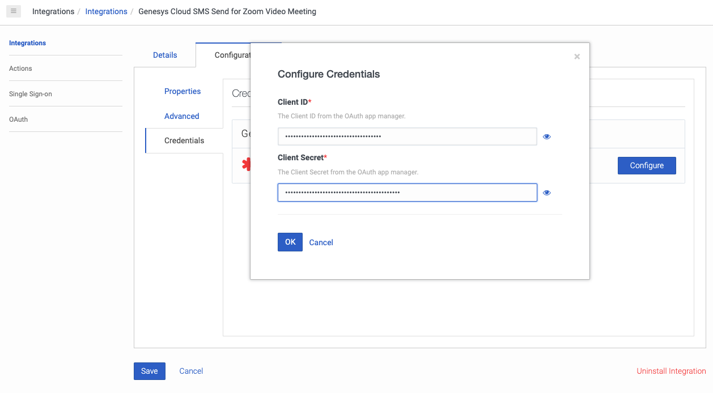
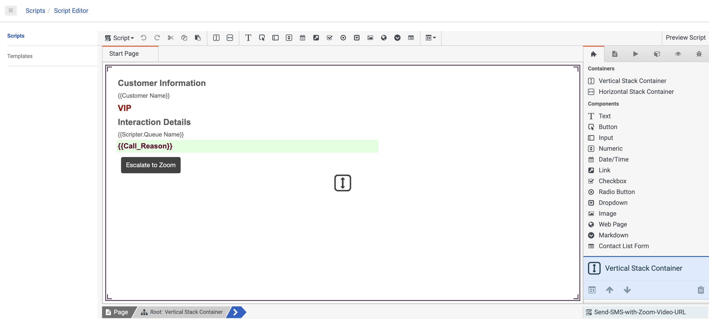
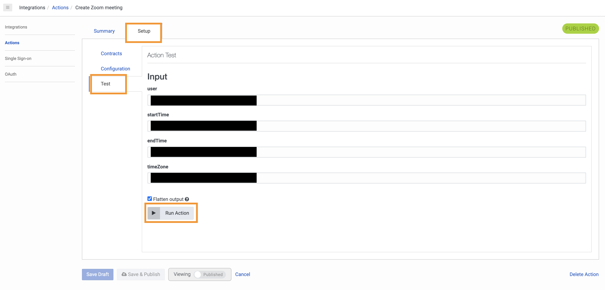

:::{"alert":"primary","title":"About Genesys Cloud Blueprints","autoCollapse":false} 
Genesys Cloud blueprints were built to help you jump-start building an application or integrating with a third-party partner. 
Blueprints are meant to outline how to build and deploy your solutions, not production-ready turn-key solutions.
 
For more details on Genesys Cloud blueprint support and practices, 
see our Genesys Cloud blueprint [FAQ](https://developer.genesys.cloud/blueprints/faq "Opens the Genesys Cloud Blueprint FAQ page") sheet.
:::

The Genesys Cloud Developer Blueprint describes how agents can schedule meetings with customers using Zoom and Genesys Cloud. Genesys Cloud sends an SMS message to the customer with a meeting URL and opens Zoom for the agent. Calls in a queue can be inbound or outbound as long as they are in a queue.

The following illustration shows the meeting scheduling solution from an agent's perspective.

The following is an example of the end-to-end experience customers and agents can expect from this blueprint.

You can enable an agent to create a Zoom meeting from their Genesys Cloud agent UI. This is done by using Genesys Cloud and Zoom public APIs. The following illustration shows the Genesys Cloud and Zoom API calls.

## Solution components

* **Genesys Cloud** - A suite of Genesys cloud services for enterprise-grade communications, collaboration, and contact center management. Contact center agents use the Genesys Cloud user interface.
* **Genesys Cloud API** - A set of RESTful APIs that enable you to extend and customize your Genesys Cloud environment. This solution uses the API to send meeting information to the caller as an agentless outbound SMS notification.
* **Amazon Web Services** - Amazon Web Services (AWS), a cloud computing platform that provides a variety of cloud services such as computing power, database storage, and content delivery. AWS hosts Genesys Cloud.
* **Zoom** - A virtual meeting and collaboration app. Zoom is the app that hosts the meeting for our solution.

## Prerequisites

### Specialized knowledge

* Administrator-level knowledge of Genesys Cloud
* Administrator-level Zoom knowledge 
* Experience with REST API authentication
* Experience creating Genesys Cloud scripts

### Genesys Cloud account

* A Genesys Cloud 3 license with agentless SMS functionality. For more information, see [Genesys Cloud Pricing](https://www.genesys.com/pricing "Opens the pricing article") website.
* The Master Admin role in Genesys Cloud. For more information, see [Roles and permissions overview](https://help.mypurecloud.com/?p=24360 "Opens the Roles and permissions overview article") in the Genesys Cloud Resource Center.

### Zoom account

* A Zoom enterprise account is required. The OAuth grant type of client_credentials used in this blueprint are not supported by personal Zoom accounts.
* Administrator-level role for Zoom that allows the user to set up authorizations and grant permissions to Genesys Cloud.
* Zoom license for agents.

## Implementation steps

* [Configure the Zoom custom app](#configure-the-zoom-custom-app "Goes to the Configure the Zoom custom app section")
* [Configure Genesys Cloud](#configure-genesys-cloud "Goes to the Configure Genesys Cloud section")
* [Add a web services data actions integration](#add-a-web-services-data-actions-integration "Goes to the Add a web services data actions integration section")
* [Create an OAuth client for use with the Genesys Cloud data action integration](#create-an-oauth-client-for-use-with-the-genesys-cloud-data-action-integration "Goes to the Create an OAuth client for use with the Genesys Cloud data action integration section")
* [Add a Genesys Cloud data actions integration](#add-a-genesys-cloud-data-actions-integration "Goes to the Add a Genesys Cloud data actions integration section")
* [Load the supporting data actions](#load-the-supporting-data-actions "Goes to the Load the supporting data actions section")
* [Import Create Zoom video meeting data action](#import-create-zoom-video-meeting-data-action "Goes to the Import Create Zoom video meeting data action section")
* [Send SMS data action](#send-sms-data-action "Goes to the Send SMS data action section")
* [Import and publish the script](#import-and-publish-the-script "Goes to the Import and publish the script section")
* [Test the deployment](#test-the-deployment "Goes to the Test the deployment section")
* [Additional resources](#additional-resources "Goes to the Additional resources section")

### Configure the Zoom custom app

Register your custom application in Zoom to enable Genesys Cloud to authenticate and retrieve user information from the Zoom API.

1. Log in to the Zoom App Marketplace.
2. From the drop-down menu, select **Develop** and click **Build App**.

3. Click **Create** in the **JWT** box. 

4. Name your app, select the type of app, turn off publishing in the Zoom App Marketplace, then click **Create**.
5. From the drop-down menu, select **View JWT Token**.
6. In the **Expiration Time** section, set **Expire in:** to **Other** and enter an expiration date.
7. Click **Copy**.

### Configure Genesys Cloud

### Add a web services data actions integration

The following web services data actions integration enable communication from Genesys Cloud to Zoom:

1. For information on installing **Web Services Data Actions** integration from Genesys Cloud, see [About the data actions integrations](https://help.mypurecloud.com/?p=209478 "Opens the data actions overview article") in the Genesys Cloud Resource Center.

2. Rename the web services data action and provide a short description.

3. Navigate to **Configuration** > **Credentials**, and click **Configure**.

4. In the **Credential Type** section, click the drop-down menu, and select **User Defined**.
5. In the **Field Name** section, click **Add Credential Field**, and add a field.
6. Enter a **Value**.
7. Click **OK**.

* Set the token to the JWT Token from your Zoom app.

8. Import authentication data action.

The authentication data action is imported into a different data action. Genesys Cloud automatically creates **Custom Auth** data actions when you integrate a new web service data action within an organization.

9. Navigate to **Integrations** > **Actions** and open the **Custom Auth** data action.

10. Click **Viewing** at the bottom of the Custom Auth data action page to change the data action state from **Published** to **Draft**.
11. From the [zoom-meetings-sms-blueprint](https://github.com/jasonwolfg/zoom-meetings-sms "Opens the zoom meetings sms") in the GitHub repository, download the auth data action file *Zoom-SMS-Video-Send-Web-Services-Data-Action-Auth.customAuth.json*. You can import this file into Genesys Cloud by saving it to your local desktop.
12. Click **Import** and select the downloaded file from the browse box location.

13. Click **Import Action** to import the custom auth data action.

14. Click **Save & Publish**.
      
   :::primary
      **Note:** In the Publish Action window, click **Yes** to publish the data action. The import action only modifies the data action configuration, not its contract.
   :::

15. Return to the web services data action integration and verify that the data action is **Active** status.

### Use Genesys Cloud OAuth client to create a custom role

1. Navigate to **Roles/Permissions**.

2. Create a customer role by typing a **Name**.

3. Under the Permission tab, you can assign the appropriate permissions to your custom role by searching and selecting **Conversation>message>Create** and **messaging>sms>send** permissions.
4. Click **Save**.

:::primary
**Note:** You must assign this role to your user record before creating the Genesys Cloud OAuth client. In your Genesys Cloud organization, the messaging>sms>send permission requires the "GMA/Portico: Non conversational bi-directional SMS, MMS, Email and RCS messaging" product must be activated.
:::

### Integrate Genesys Cloud data actions with an OAuth client

A Genesys Cloud OAuth client must be configured to enable Genesys Cloud data requests to an organization.

1. Navigate to **Integrations** > **OAuth** and click **Add Client**.

2. Enter an **App Name**.
3. For the Grant Type, select **Client Credentials**. 
4. Click the **Roles** tab and select **Client Credentials**.

:::primary
   **Note:** Select a custom role that includes the permission Messaging > Sms > Send. Default roles do not include this permission. To create a custom role, see the Custom roles information in the [Roles and permissions overview](https://help.mypurecloud.com/?p=24360 "Opens the Roles and Permission overview article") in the Genesys Cloud Resource Center.
:::

5. Click **Save** and record the Client ID and Client Secret values to use later.

### Adding Genesys Cloud data action integration

Zoom video session URLs are sent to customers via SMS from Genesys Cloud. This SMS capability can be enabled by integrating Genesys Cloud data actions.

1. Install the **Genesys Cloud Data Actions** integration. For more information, see [About the data actions integrations](https://help.mypurecloud.com/?p=209478 "Opens the Data Actions overview article").

2. In the **Details** tab, enter a Genesys Cloud data action name.

3. In the **Configuration** tab, select **Credentials** and click **Configure**.

4. Enter the OAuth **Client ID** and **Client Secret** you noted when creating the [OAuth client creation](#create-an-oauth-client-for-use-with-the-genesys-cloud-data-action-integration "Goes to the Genesys Cloud data action section"). 

5. Click **OK** to save the data action.

6. On the main Integrations page, select the SMS data action integration and set it to **Active**.

### Load the supporting data actions

To enable the **Send SMS** button that sends the Zoom video session URL to the customer, you must import two more data actions.
* [Import Create Zoom video meeting data action](#import-create-zoom-video-meeting-data-action "Goes to the Import Create Zoom video meeting data action section")
* [Send SMS data action](#send-sms-data-action "Goes to the Send SMS data action section")

### Import Create Zoom video meeting data action

The Create Zoom Video Meeting uses the authenticated token obtained from other data actions to create a new Zoom meeting URL.

1. Download the *Create-Zoom-Meeting.custom.json* file in the [zoom-meetings-sms repo](https://github.com/jasonwolfg/zoom-meetings-sms "Opens the GitHub repo") GitHub repository. You can import this file into Genesys Cloud by saving it on your local desktop.

2. In the navigation panel, click **Integrations** > **Actions** and then click **Import**.

3. Select the *Create-Zoom-Meeting.custom.json* file and associate it with the web services data action you created in the [Add a web services data actions integration](#add-a-web-services-data-actions-integration "Goes to the Add a web services data actions integration section") section and click **Import Action**.

### Send SMS data action
This data action sends an SMS message to the customer that contain the Zoom video meeting URL. The URL is created by the Create Zoom Video Meeting data action.

1. Download the *Send-SMS.custom.json* file from the [zoom-meetings-sms repo](https://github.com/jasonwolfg/zoom-meetings-sms "Opens the GitHub repo") in the GitHub repository. Save this file on your local desktop to import it into Genesys Cloud.
2. In the navigation panel, click **Integrations** > **Actions** and then click **Import**.

3. Select the *Send-SMS.custom.json* file and associate it with the web services data action you created in the [Add a web services data actions integration](#add-a-web-services-data-actions-integration "Goes to the Add a web services data actions integration section") section and click **Import Action**.

### Import and publish the script

You need to import the script *Send-SMS-with-Zoom-Video-URL.script*, which references the created data actions. The script generates the **Escalate to Zoom** button for agents when they are engaged in an active customer interaction. In addition, an SMS is sent to customer with the Zoom video URL.

1. Download the *Send-SMS-with-Zoom-Video-URL.script* file from the [zoom-meetings-sms repo](https://github.com/jasonwolfg/zoom-meetings-sms "Opens the GitHub repo") in the GitHub repository. Save the file on your local desktop to import it into Genesys Cloud.  

2. Navigate to **Admin** > **Contact Center** > **Scripts** and click **Import**.

3. Select the downloaded *Send-SMS-with-Zoom-Video-URL.script* file.

4. Open the imported script to configure it for use in an outbound message.

5. Click the **Actions** icon and select **Escalate to Zoom** from the drop-down menu.

6. Expand the First Data Action.

7. Click the **Category** drop-down menu to select the category associated with your "Create Zoom Meeting" data action. 
8. Click the **Data Action** drop-down menu to select the data action associated with your "Create Zoom Meeting".

9. Expand the input variables for the first Data Action.

10. Enter the desired value in the **user** Insert Variable field.

  :::primary
  **Note:** As shown in the following example, the variable value creates a Zoom meeting through the agent's Zoom account. The agent's Genesys Cloud email address must match their Zoom email address for this to work. It is possible to define a static value here if you wish to use the same Zoom account regardless of which agent is on the interaction. This can be the email address or object ID of the person whose app is registered in the Zoom Activity Directory.
  :::

11. Expand the Output variables for the first Data Action so that the url variables are mapped.

12. Expand the second data action.

13. Click the **Category** drop-down menu to select the category associated with your "Send SMS" data action.  
14. Click the **Data Action** drop-down menu to select the data action associated with your "Send SMS".

 

15. Expand the input variables for the second Data Action.

16. In the **fromAddress** input variable field, enter one of your Genesys Cloud organization's purchased SMS Numbers.

 :::primary
 **Note:** The following resource provides detailed information on how to purchase an SMS number. The phone number must be entered in the format +11234567890.
 :::

 

The remaining input variables of the second data action must match the following example.

 

17. Under the **Custom Action Name**, click **Save**.

18. Click the **Script** drop-down menu and select **Save**.

19. Click the **Script** drop-down menu and select **Publish**.

20. Navigate to **Admin** > **Contact Center** > **Queues** and select the queue you would like to associate with this script.

21. Click the **Voice** tab.
22. From the **Default Script** drop-down menu, select the **Send-SMS-with-Zoom-Video-URL** script.

## Test deployment

Within the data action, you can test the Create Zoom video meeting URL data action.

1. Navigate to **Admin** > **Integrations** > **Actions** and select **Create Zoom meeting** data action.

2. Navigate to **Setup** > **Test**, enter a **user**, **startTime**, **endTime** and **timeZone**, then click **Run Action**.

:::primary
    **Note:** The startTime and endTime parameters must be in ISO-8601 format. The user parameter can be the Zoom user's ActiveDirect Object ID or email address.
:::

Within the data action, you can test the Send SMS data action.

1. Navigate to **Admin** > **Integrations** > **Actions** and select **Send SMS** data action.

2. Navigate to **Setup** > **Test**, enter a **user**, **startTime**, **endTime** and **timeZone**, then click **Run Action**.

:::primary
   **Note:** You must use one of the purchased SMS Numbers within your Genesys Cloud organization as the fromAddress parameter. For more information on how to purchase an SMS number, refer to the following resources. The toAddressMessengerType must be "sms".
:::

## Additional resources

- [Create a Zoom Meeting](https://marketplace.zoom.us/docs/api-reference/zoom-api/methods#operation/meetingCreate "Opens Zoom Meeting API 2.0.0 page") on the Zoom API Reference website.
- [Purchase SMS long code numbers](https://help.mypurecloud.com/articles/purchase-sms-long-code-numbers/) in the Genesys Cloud Resource Center.
- [About Scripting](https://help.mypurecloud.com/?p=54284 "Opens the Scripting overview article") in the Genesys Cloud Resource Center.
- [Agentless SMS Notifications](https://developer.mypurecloud.com/api/tutorials/agentless-sms-notifications/index.html?language=java&step=1 "Opens the Agentless SMS Notifications page") in the Genesys Cloud Developer Center.
- [Automatic SMS after Call](https://developer.mypurecloud.com/api/tutorials/sms-sending/index.html?language=nodejs&step=1 "Opens the Automatic SMS after Call") in the Genesys Cloud Developer Center.
