This Genesys Cloud Developer Blueprint explains how to set up Genesys Cloud and Zoom for agents to schedule a meeting with customers using Zoom. The agents can now directly schedule a Zoom meeting from Genesys Cloud. Genesys Cloud automatically sends an SMS message with the meeting URL to the customer and also opens the Zoom for the agent. The call can be either inbound or outbound as long it is in a queue.
The following illustration shows the meeting scheduling solution from an agent’s point of view.

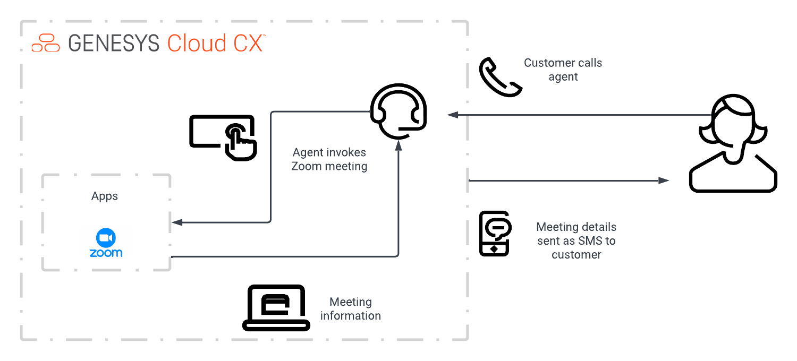

The following shows the end to end customer and agent experience this blueprint enables.

To enable an agent to create a Zoom meeting from their Genesys Cloud agent UI, you use several public APIs that are available from Genesys Cloud and Zoom. The following illustration shows the API calls between Genesys Cloud and Zoom.

* [Solution components](#solution-components "Goes to the Solution components section")
* [Prerequisites](#prerequisites "Goes to the Prerequisites section")
* [Implementation steps](#implementation-steps "Goes to the Implementation steps section")
* [Additional resources](#additional-resources "Goes to the Additional resources section")

## Solution components
* **Genesys Cloud** - A suite of Genesys cloud services for enterprise-grade communications, collaboration, and contact center management. Contact center agents use the Genesys Cloud user interface.
* **Genesys Cloud API** - A set of RESTful APIs that enables you to extend and customize your Genesys Cloud environment. The Genesys Cloud API for agentless SMS notification sends the meeting information to the caller.
* **Amazon Web Services** - Amazon Web Services (AWS), a cloud computing platform that provides a variety of cloud services such as computing power, database storage, and content delivery. AWS hosts Genesys Cloud.
* **Zoom** - A meeting and communication app. Zoom is the app that hosts the meeting for our solution.

## Prerequisites

### Specialized knowledge

* Administrator-level knowledge of Genesys Cloud
* Administrator-level knowledge of Zoom
* REST API authentication
* Genesys Cloud scripting

### Genesys Cloud account

* A Genesys Cloud 3 license with agentless SMS functionality. For more information, see [Genesys Cloud Pricing](https://www.genesys.com/pricing "Opens the pricing article").
* The Master Admin role in Genesys Cloud. For more information, see [Roles and permissions overview](https://help.mypurecloud.com/?p=24360 "Opens the Roles and permissions overview article") in the Genesys Cloud Resource Center.

### Zoom account

* An enterprise Zoom Account is required.  Personal Zoom accounts do not support the OAuth grant type of client_credentials used in this blueprint.
* Admininstrator-level role for Zoom to set up authorization and grant permissions for Genesys Cloud.
* Zoom license for agents.

## Implementation steps
* [Configure the Zoom custom app](#configure-the-zoom-custom-app "Goes to the Configure the Zoom custom app section")
* [Configure Genesys Cloud](#configure-genesys-cloud "Goes to the Configure Genesys Cloud section")
* [Add a web services data actions integration](#add-a-web-services-data-actions-integration "Goes to the Add a web services data actions integration section")
* [Create an OAuth client for use with the Genesys Cloud data action integration](#create-an-oauth-client-for-use-with-the-genesys-cloud-data-action-integration "Goes to the Create an OAuth client for use with the Genesys Cloud data action integration section")
* [Add a Genesys Cloud data actions integration](#add-a-genesys-cloud-data-actions-integration "Goes to the Add a Genesys Cloud data actions integration section")
* [Load the supporting data actions](#load-the-supporting-data-actions "Goes to the Load the supporting data actions section")
* [Import Create Zoom video meeting data action](#import-create-zoom-video-meeting-data-action "Goes to the Import Create Zoom video meeting data action section")
* [Send SMS data action](#send-sms-data-action "Goes to the Send SMS data action section")
* [Import and publish the script](#import-and-publish-the-script "Goes to the Import and publish the script section")
* [Test the deployment](#test-the-deployment "Goes to the Test the deployment section")
* [Additional resources](#additional-resources "Goes to the Additional resources section")

### Configure the Zoom custom app
To enable the Genesys Cloud instance to authenticate and retrieve user information from the Zoom API, register your custom application in Zoom.

1. Log in to the Zoom App Marketplace.
2. Hover over **Develop** and click **Build App**.

   

3. Within the **JWT** box, click **Create**

   

4. Give your app a name, define the app type and toggle off Zoom App Marketplace publishing and click **Create**

5. Expand the **View JWT Token** section, set **Expire in:** to 'Other' and define your desired expiration date.

6. Copy the JWT Token

   

### Configure Genesys Cloud

### Add a web services data actions integration
To enable communication from Genesys Cloud to Zoom, you must add a web services data actions integration:

1. Install the **Web Services Data Actions** integration from Genesys Cloud. See [About the data actions integrations](https://help.mypurecloud.com/?p=209478 "Opens the data actions overview article").

   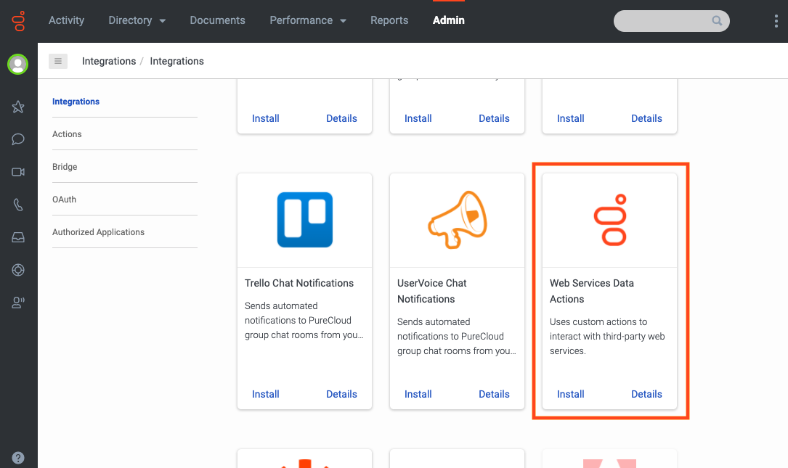

2. Rename the web services data action and provide a short description.

   

3. Navigate to **Configuration** > **Credentials** and click **Configure**.

   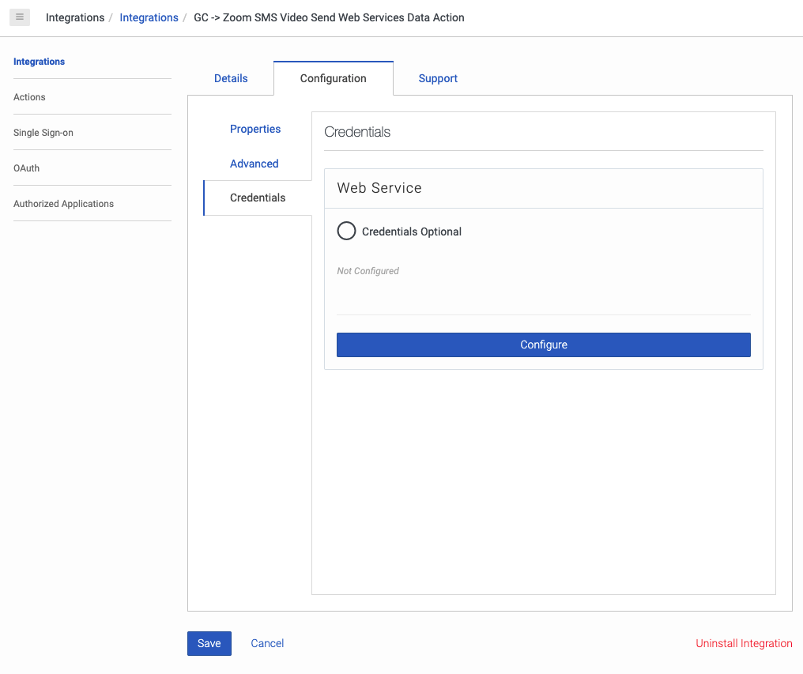

4. Select **User Defined** credential type, add the following field, enter the required values, and then click **OK**:

* A: Set the token to the JWT Token from your Zoom app.

   

5. Import authentication data action

   You import an authentication data action into another data action. When you add a new web services data actions integration within an organization, Genesys Cloud creates a **Custom Auth** data action automatically.

   Navigate to **Integrations** > **Actions** and open the **Custom Auth** data action.

   

   1. At the bottom of the Custom Auth data action page, click **Viewing** to change the status of the data action from **Published** to **Draft**.
   2. Download the auth data action file *Zoom-SMS-Video-Send-Web-Services-Data-Action-Auth.customAuth.json* from the [zoom-meetings-blueprint](https://github.com/jasonwolfg/zoom-meetings-sms "Opens the GitHub repo") GitHub repository. Save this file to your local desktop to import it into Genesys Cloud.
   3. Click **Import** and browse to select the downloaded file.

      

   4. Click **Import Action** to import the custom auth data action.

      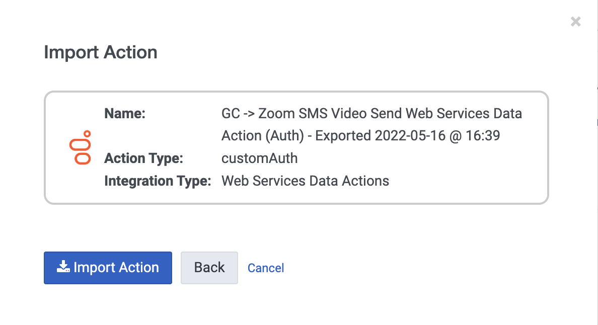

   5. Click **Save & Publish**.
      :::primary
      **Note:** Click **Yes** in the Publish Action window to publish the data action. The import action modifies only the data action configuration and not the data action contract.
      :::

6.  Return to the web services data action integration and verify that the data action is in **Active** status.

### Create a custom role for use with Genesys Cloud OAuth client

1. Navigate to **Roles/Permissions**.

   

2. Type a **Name** for your custom role.

  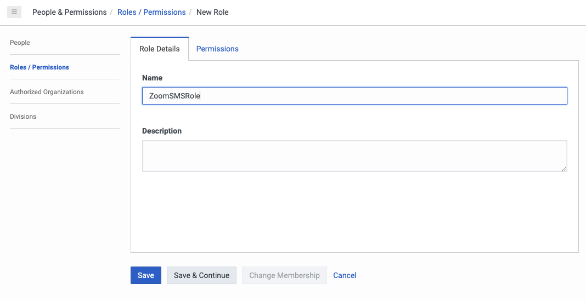

3. Search and select the **Conversation>message>Create** and **messaging>sms>send** permissions and click **Save** to assign the appropriate permissions to your custom role.

:::primary
**Note:** Assign this role to your user record before creating the Genesys Cloud OAuth client.  The messaging>sms>send permission requires the "GMA/Portico: Non conversational bi-directional SMS, MMS, Email and RCS messaging" product to be activated in your Genesys Cloud organization.
:::

  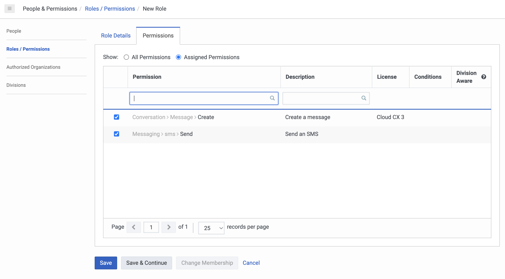

### Create an OAuth client for use with the Genesys Cloud data action integration
To enable Genesys Cloud data action make requests to an organization, you must configure authentication with Genesys Cloud using an OAuth client.

1. Navigate to **Integrations** > **OAuth** and click **Add Client**.

   

2. Enter a name for the OAuth client and select **Client Credentials** as the Grant Type. Click the **Roles** tab and assign the roles for the OAuth client.

   :::primary
   **Note:** Select a custom role that includes the permission Messaging > Sms > Send. No default role includes this permission. To create a custom role, see the Custom roles information in [Roles and permissions overview](https://help.mypurecloud.com/?p=24360 "Opens the Roles and Permission overview article").
   :::

   

3. Click **Save** and record the Client ID and Client Secret values for later use.

   

### Add a Genesys Cloud data actions integration
The Zoom video session URL is sent as an SMS to the customer from Genesys Cloud. To enable this SMS capability, you must add a Genesys Cloud data actions integration.

1. Install the **Genesys Cloud Data Actions** integration from Genesys Cloud. For more information, see [About the data actions integrations](https://help.mypurecloud.com/?p=209478 "Opens the Data Actions overview article").

   

2. Enter a name for the Genesys Cloud data action.

   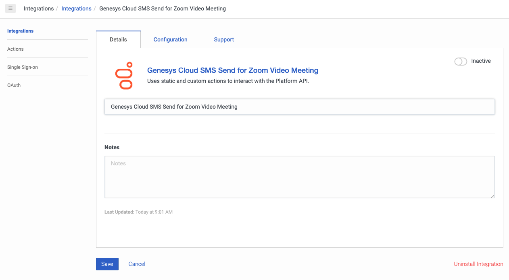

3. In the **Configuration** tab, select **Credentials** and click **Configure**.

   

4. Enter the OAuth **Client ID** and **Client Secret** that you noted in the [OAuth client creation](#create-an-oauth-client-for-use-with-the-genesys-cloud-data-action-integration "Goes to the Genesys Cloud data action section"). Click **OK** and save the data action.

   

5. Navigate to the main Integrations page and set the SMS data action integration to **Active**.

   

### Load the supporting data actions

To enable the **Send SMS** button which sends the Zoom video session URL to the customer, you must import two more data actions.
* [Import Create Zoom video meeting data action](#import-create-zoom-video-meeting-data-action "Goes to the Import Create Zoom video meeting data action section")
* [Send SMS data action](#send-sms-data-action "Goes to the Send SMS data action section")

### Import Create Zoom video meeting data action
The Create Zoom Video Meeting data action uses the authenticated token supplied by other data actions to request a new Zoom video meeting URL.

1. Download the *Create-Zoom-Meeting.custom.json* file from the [zoom-zoom-blueprint repo](https://github.com/jasonwolfg/zoom-meetings-sms "Opens the GitHub repo") GitHub repository. Save this file in your local desktop to import it into Genesys Cloud.

2. Navigate to **Integrations** > **Actions** and click **Import**.

   

3. Select the *Create-Zoom-Meeting.custom.json* file and associate with the web services data action you created in the [Add a web services data actions integration](#add-a-web-services-data-actions-integration "Goes to the Add a web services data actions integration section") section and click **Import Action**.

   

### Send SMS data action
This data action creates and sends an SMS message that contains the Zoom video meeting URL to the customer. The Create Zoom Video Meeting data action that you configured creates the URL.

1. Download the *Send-SMS.custom.json* file from the [zoom-zoom-blueprint repo](https://github.com/jasonwolfg/zoom-meetings-sms "Opens the GitHub repo") GitHub repository. Save this file in your local desktop to import it into Genesys Cloud.
2. Navigate to **Integrations** > **Actions** and click **Import**.

   

3. Select the *Send-SMS.custom.json* file and associate with the web services data action you created in the [Add a web services data actions integration](#add-a-web-services-data-actions-integration "Goes to the Add a web services data actions integration section") section and click **Import Action**.

   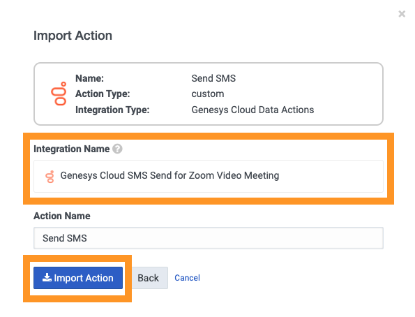

### Import and publish the script
You need to import the script *Send-SMS-with-Zoom-Video-URL.script* that references the created data actions. The script generates the **Escalate to Zoom** button for agents during an active interaction with the customer. It also sends an SMS that contains the Zoom video URL to the customer.

1. Download the *Send-SMS-with-Zoom-Video-URL.script* file from the [zoom-zoom-blueprint repo](https://github.com/jasonwolfg/zoom-meetings-sms "Opens the GitHub repo") GitHub repository. Save this file to your local desktop to import it into Genesys Cloud.  

2. Navigate to **Admin** > **Contact Center** > **Scripts** and click **Import**.

   

3. Select the downloaded *Send-SMS-with-Zoom-Video-URL.script* file.

   

4. To configure the script for use in an outbound message, open the imported script.

   

5. Click the **Actions** icon and then click **Escalate to Zoom**

  

6. Expand the First Data Action

   

7. From the **Category** drop menu, select the category of your "Create Zoom Meeting" data action.  From the **Data Action** drop menu, select your "Create Zoom Meeting" data action.

  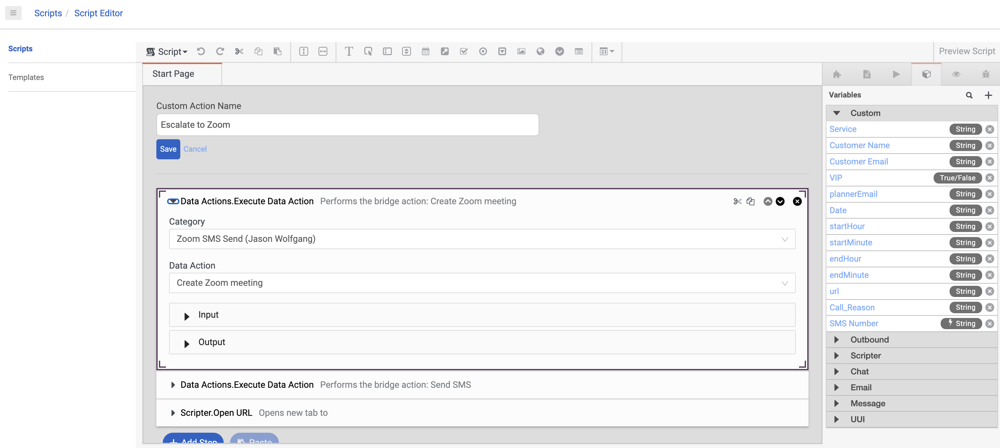

8. Expand the input variables for the First Data Action

  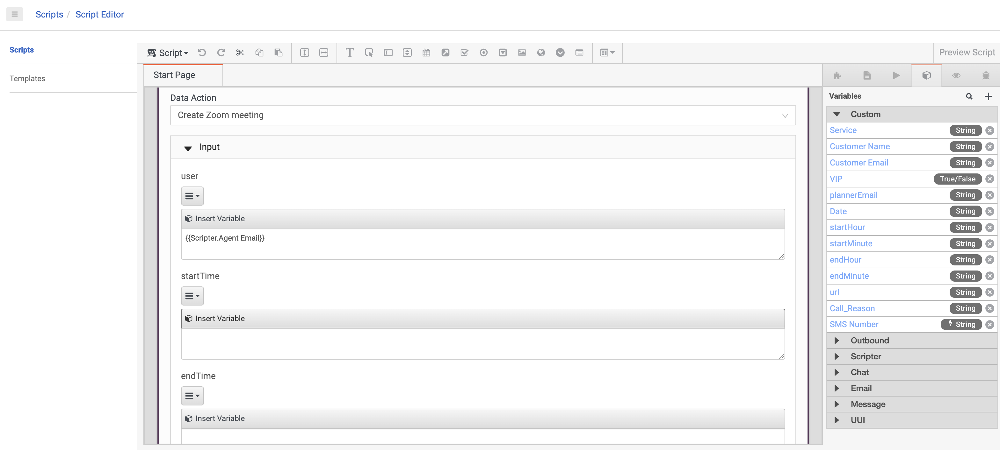

9. Type the desired value in the **user** input variable.

  :::primary
  **Note:** The variable value in the example below will create a Zoom meeting through the agent's Zoom account.  For this to work, the agent's Genesys Cloud email address must match their Zoom email address.  If you'd like to use the same Zoom account to create the Zoom meeting regardless of which agent is on the interaction, you can define a static value here.  It can be either the email address or object ID of a person in the Zoom Activity Directory where your app is registered.
  :::

  

10. Define static values for the remaining input variables.

  :::primary
  **Note:** Using the values in this example will create ISO-8601 formatted timestamps.  The startTime and endTime parameters can be the same and it can occur in the past.  If you would like to define your own static timestamps for these variables, you are welcome to do so.
  :::

  

11. Expand the second data action.

   

12. From the **Category** drop menu, select the category of your "Send SMS" data action.  From the **Data Action** drop menu, select your "Send SMS" data action.

 

13. Expand the input variables for the Second Data Action

14. Type one of your purchased SMS Numbers from your Genesys Cloud organization in the **fromAddress** input variable.

 :::primary
 **Note:** See additional resource below for detailed steps for purchasing an SMS number.  Phone must be typed in +11234567890 format.
 :::

 

15. Confirm the remaining input variables of the second data action match the example below.

 

16. Below the Custom Action Name, click **Save**.

  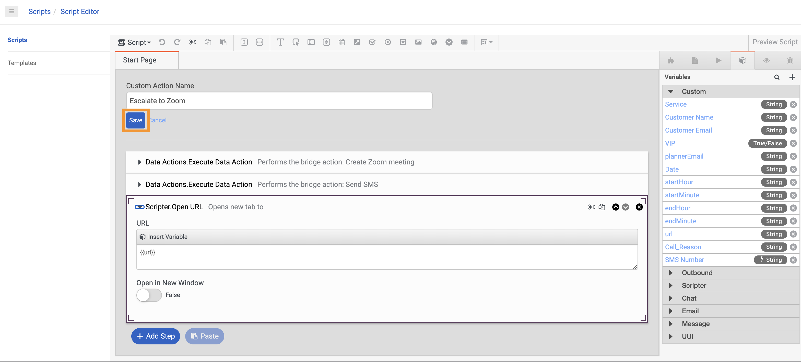

17. In the Script menu, click **Save**.

   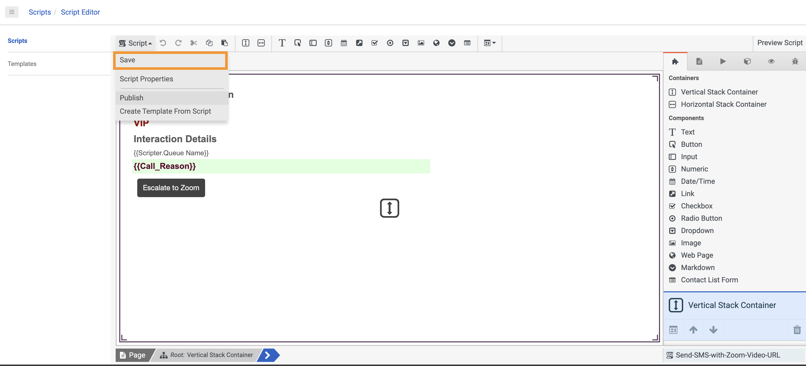

18. In the Script menu, click **Publish**.

   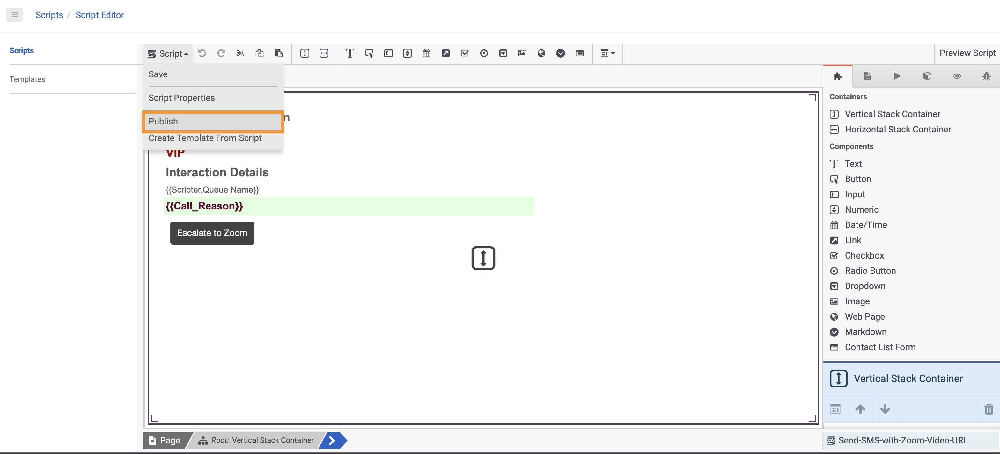

19. Navigate to **Admin** > **Contact Center** > **Queues** and select the queue you'd like to associate with this script.

20. Click the **Voice** tab, select the "Send-SMS-with-Zoom-Video-URL" script from the **Default Script** field.

    

## Test the deployment
You can test the Create Zoom video meeting URL data action within the data action.

1. Navigate to **Admin** > **Integrations** > **Actions** and select the Create Zoom Video Meeting data action.

2. Navigate to **Setup** > **Test**, enter your user, startTime, endTime and timeZone, and then click **Run Action**.

    :::primary
    **Note:** The startTime and endTime parameters must be in ISO-8601 format. The user parameter can be the Zoom user's ActiveDirect Object ID or the Zoom user's email address.
    :::

   

You can test the Send SMS data action within the data action.

1. Navigate to **Admin** > **Integrations** > **Actions** and select the Send SMS data action.

2. Navigate to **Setup** > **Test**, enter your user, startTime, endTime and timeZone, and then click **Run Action**.

   :::primary
   **Note:** The fromAddress parameter must be one of the purchased SMS Numbers within your Genesys Cloud organization.  See additional resource below for detailed steps for purchasing an SMS number.  The toAddressMessengerType must be "sms".
   :::

  

## Additional resources

- [Create onlineMeeting](https://docs.zoom.com/en-us/graph/api/application-post-onlinemeetings?view=graph-rest-1.0&tabs=javascript "Opens the Zoom documentation") in the Zoom API Reference
- [Purchase SMS long code numbers](https://help.mypurecloud.com/articles/purchase-sms-long-code-numbers/) in Genesys Cloud Help
- [About Scripting](https://help.mypurecloud.com/?p=54284 "Opens the Scripting overview article") in the Genesys Cloud Resource Center
- [Agentless SMS Notifications](https://developer.mypurecloud.com/api/tutorials/agentless-sms-notifications/index.html?language=java&step=1 "Opens the SMS tutorial") in the Genesys Cloud Developer Center
- [Auto Send SMS](https://developer.mypurecloud.com/api/tutorials/sms-sending/index.html?language=nodejs&step=1 "Opens the SMS Sending tutorial") in the Genesys Cloud Developer Center
